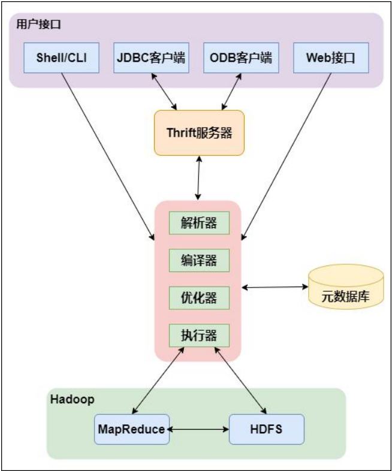

# Hive

Hive 是建立在[Hadoop](https://hadoop.apache.org/) 上的数据仓库基础构架，可以将结构化的数据文件映射成一张数据表，实现了对大量数据的轻度汇总、查询和分析功能。Hive 定义了简单的类SQL 查询语言，简称为HQL，用户可以使用HQL进行数据读写以及计算。同时，HQL可以集成自己的功能来进行自定义分析，例如 User Defined Functions (UDF)。  

### Hive的架构

**用户连接接口**：Shell/CLI是指Shell命令，JDBC/ODBC是指Hive的java实现，Web接口是指可通过浏览器访问Hive

**Thrift Server**：Hive的可选组件，是一个软件框架服务，允许客户端使用多种编程语言通过编程方式远程访问Hive

**元数据**：Hive将元数据存储在如MySQL、Derby等数据库中。Hive的元数据包括表名、表所属的数据库名、表的拥有者、列与分区字段信息、表类型、表数据所在的路径等

**驱动器(Driver)**：驱动器包含解析器(SQLParser)、编译器(Compiler)、优化器(Optimizer)、执行器(Executer)。完成HQL查询语句从语法解析、语法分析、语法编译、语法优化以及查询计划的生成。生成的查询计划存储在HDFS上，之后提交给Hadoop的YARN，随后调用MapReduce执行

### 本地模式安装

安装Hive之前先安装Hadoop、Java和MySQL(使用MySQL保存元数据)，在Hive官网[下载](http://archive.apache.org/dist/hive/)需要的Hive安装包

上传安装包到服务器，此处选择安装到/usr/local下，将安装包解压到指定目录

~~~shell
tar -zvxf apache-hive-2.1.1-bin.tar.gz -C /usr/local
~~~

进去安装目录修改安装文件名

~~~shell
cd /usr/local
mv apache-hive-2.1.1-bin hive
~~~

进入/etc/profile文件配置Hive环境变量

~~~shell
vi /etc/profile
# 添加如下内容
export HIVE_HOME=/usr/local/hive
export PATH=$HIVE_HOME/bin:$PATH
~~~

让profile文件生效

~~~shell
source /etc/profile
~~~

配置hive-env.sh：进入hive目录下的conf目录，复制出一个hive-env.sh文件

~~~shell
cd hive/conf
cp hive-env.sh.template hive-env.sh
~~~

~~~shell
vi hive-env.sh
# 添加如下内容，此处JAVA_HOME和HADOOP_HOME根据自己安装的路径配置
export HIVE_CONF_DIR=/usr/local/hive/conf
export JAVA_HOME=/usr/local/jdk
export HADOOP_HOME=/usr/local/hadoop
export HIVE_AUX_JARS_PATH=/usr/local/hive/lib
~~~

配置hive-site.xml：在hive/conf目录下复制出一个hive-site.xml文件。把hive-site.xml 中所有包含`${system:java.io.tmpdir}`替换成`/usr/local/hive/iotmp.`，如果系统默认没有指定系统用户名,那么要把配置`${system:user.name}`替换成当前用户名`root`，并且修改如下的四个配置。

> 需要降低MySQL密码策略机制，改为low。hive的元数据在mysql库里创建的数据库hive的编码最好设置成latin1

~~~shell
cp hive-default.xml.template hive-site.xml
vi hive-site.xml
~~~

~~~xml
<!--配置mysql的连接字符串-->
<property>
<name>javax.jdo.option.ConnectionURL</name>
<value>jdbc:mysql://master:3306/hive?createDatabaseIfNotExist=true</value>
<description>JDBC connect string for a JDBC metastore</description>
</property>
<!--配置mysql的连接驱动-->
<property>
<name>javax.jdo.option.ConnectionDriverName</name>
<value>com.mysql.jdbc.Driver</value>
<description>Driver class name for a JDBC metastore</description>
</property>
<!--配置登录mysql的用户-->
<property>
<name>javax.jdo.option.ConnectionUserName</name>
<value>root</value>
<description>username to use against metastore database</description>
</property>
<!--配置登录mysql的密码-->
<property>
<name>javax.jdo.option.ConnectionPassword</name>
<value>123456</value>
<description>password to use against metastore database</description>
</property>
~~~

配置好hive-site.xml后，需要下载上传MySQL的驱动包`mysql-connector-java-5.7.23-bin.jar`到/usr/local/hive/lib下，随后启动HDFS和YARN

~~~shell
start-dfs.sh
start-yarn.sh
~~~

初始化数据库

~~~shell
schematool -initSchema -dbType mysql
~~~

启动Hive

~~~sh
hive
~~~

### 数据类型与存储格式

~~~mathematica
数据类型    描述
BOOLEAN	   true/false   
TINYINT	   1字节的有符号整数，表示范围: -128~127
SMALLINT   2个字节的有符号整数，表示范围: -32768~32767
INT	       4个字节的带符号整数，表示范围: -2147483648~2147483647
BIGINT	   8字节带符号整数，表示范围: -2^64~2^64-1
FLOAT	   4字节单精度浮点数
DOUBLE	   8字节双精度浮点数
DEICIMAL   任意精度的带符号小数
STRING	   字符串
VARCHAR	   变长字符串
CHAR	   固定长度字符串
BINARY	   字节数组
TIMESTAMP  时间戳
DATE	   日期
ARRAY	   数组类型
MAP	       key-value,key必须为原始类型，value可以任意类型	map(‘a’,1,’b’,2)
STRUCT	   段集合,类型可以不同
~~~

~~~sql
select
    user_id,
    scope
from
(
    select
        user_id,
        scope,
        row_number() over(partition by user_id order by total desc, n desc) as rk
    from 
    (
        select
            user_id,
            scope,
            case scope when '0-1' then 1 when '2-5' then 3 when '5-10' then 4
                       when '1-2' then 2 when '10-20' then 5 else 6 end as n,
            sum(total) as total
        from t1
        group by user_id, scope
    ) b
) a
where rk = 1;
~~~

